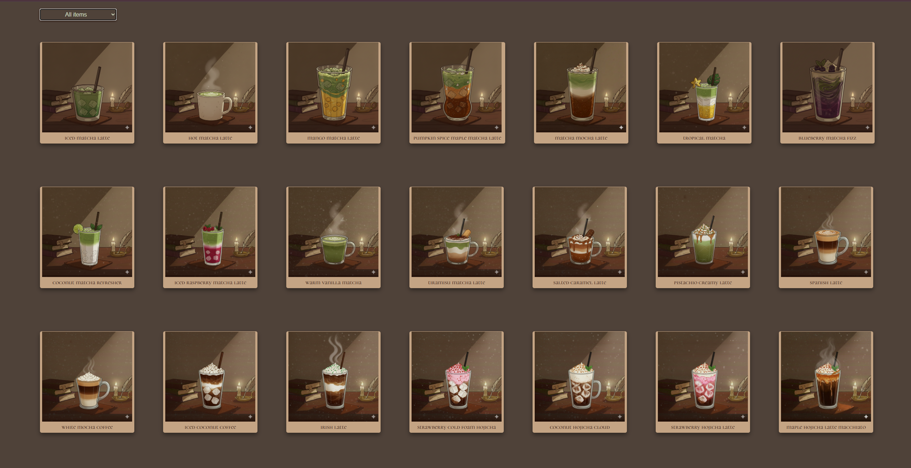
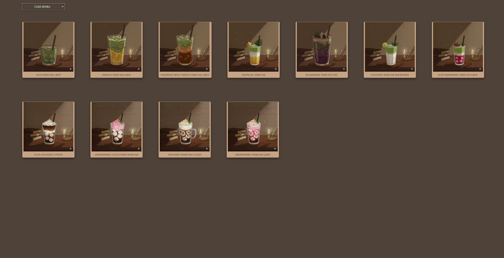
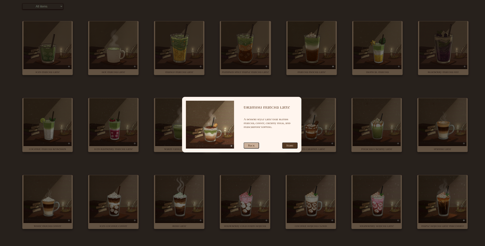
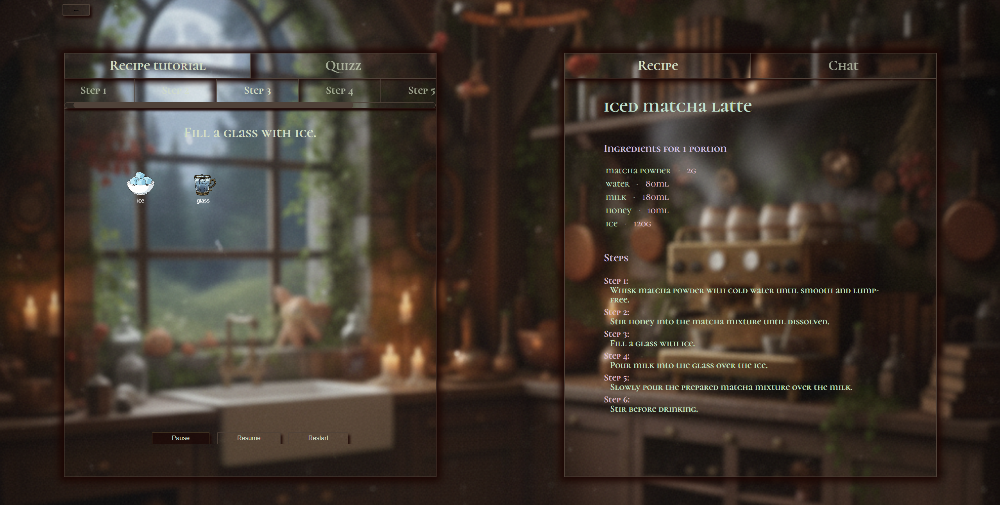
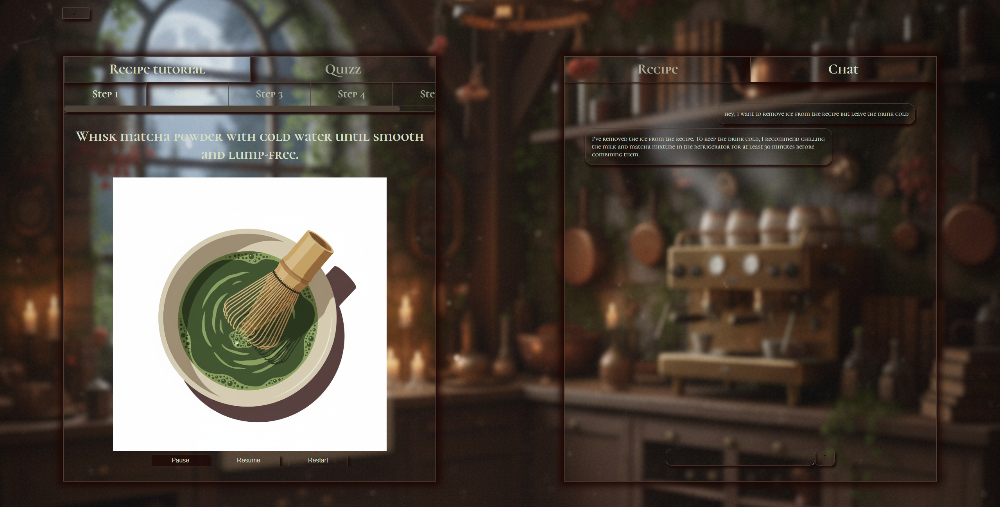
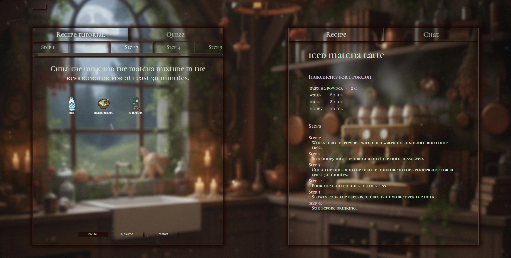
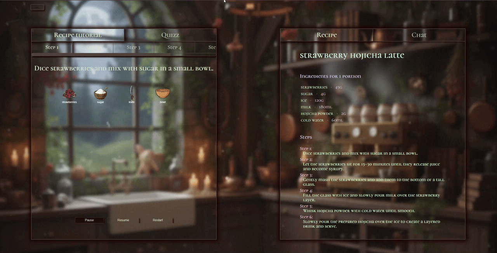
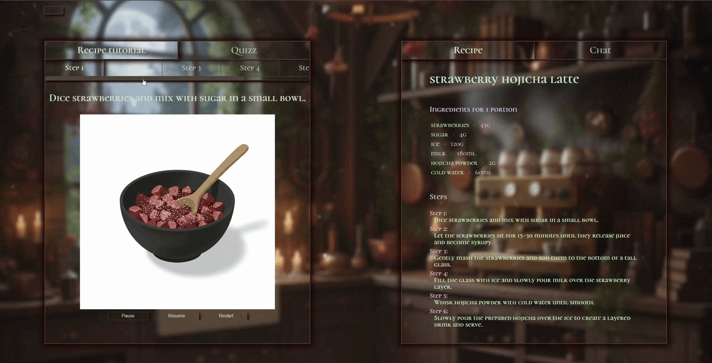

# Interactive Recipe Tutorial App

An AI-powered cooking assistant that teaches you recipes step-by-step through animated ingredient visualizations, real-time chat, and generated imagery.


### Features:

- Animated Canvas Tutorial — Ingredients and tools animate toward each other in a step-by-step visual, culminating in a particle explosion and an AI-generated result image.
- AI Recipe Chat — Ask questions about any recipe and get contextual answers. The agent can also dynamically modify the recipe in-conversation (adjust portions, swap ingredients, etc.).
- Step-by-Step Breakdown — Each recipe step is parsed server-side to extract relevant ingredients, tools, and actions.
- AI Image Generation — Ingredient and result images are generated and segmented automatically via a backend pipeline.
- Recipe Collection — Browse, filter (warm/cold drinks), and preview recipes before starting.


### Tech Stack:
  Frontend:

  -  React + TypeScript
  -  React Router
  -  HTML5 Canvas API (custom animation engine)
  -  CSS (custom design system — no UI library)

  Backend

  -  Node.js + Express (REST API, localhost:8080)
  -  Python 3.14 (AI agent subprocesses)
  -  Google ADK (LlmAgent, Runner, InMemorySessionService)
  -  Gemini 2.5 Flash / Flash-Lite (chat, step separation, image generation)
  -  ComfyUI (local diffusion workflow runner)


### Getting Started
  Prerequisites

  -  Node.js 18+
  -  Python 3.10+
  -  ComfyUI running locally at http://127.0.0.1:8188
  -  ComfyUI custom nodes: ComfyUI-segment-anything
  -  Models downloaded into ComfyUI:

    -  GroundingDINO_SwinB 
    -  sam_hq_vit_h 


  -  A Google Gemini API key


Backend Setup:

```bash

  npm install
  pip install google-adk google-genai python-dotenv
```

Create .env file in /backend, copy the variables below putting there your values:
```env
  GOOGLE_API_KEY=your_key_here
  GEMINI_API_KEY=your_key_here
  PYTHON_PATH=C:\Users\you\AppData\Local\Programs\Python\Python314\python.exe
  COMFY_OUTPUT_DIR=D:/ComfyUI/output
```

GEMINI_API_KEY — get yours at aistudio.google.com
PYTHON_PATH — path to your Python executable (/usr/bin/python3 on Mac/Linux)
COMFY_OUTPUT_DIR — path to your local ComfyUI output folder


Start the backend:

```bash

  npm start
```

Frontend setup:

```bash

  cd frontend
  npm install
  npm run dev
```

### Collection Page
Browse and filter all available recipes. Click any card to preview the recipe before starting.



 



### Recipe Page
View the full ingredient list and step-by-step instructions for the selected recipe.
Switch to the Chat tab to ask questions or request modifications — swap ingredients,
adjust portions, or make it vegan. The recipe updates live based on the agent's response.

  

### Tutorial Board
Each recipe step gets its own animated visual. Ingredients and tools slide toward the center,
explode into particles, and reveal an AI-generated image showing the result of that step.
Navigate between steps using the tabs at the top. Images are generated on the fly and cached
so switching back to a previous step is instant.






